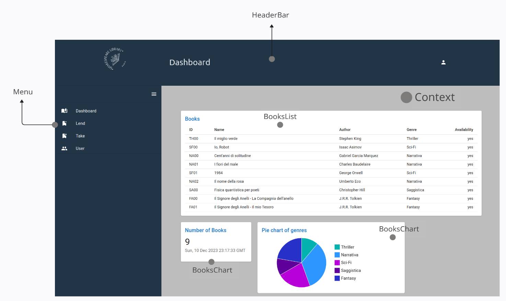
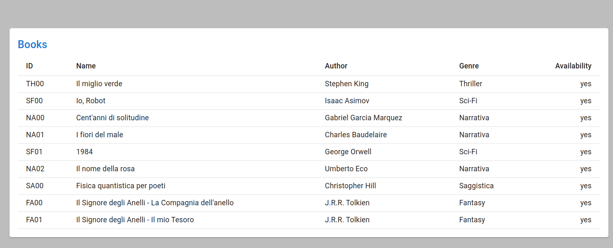
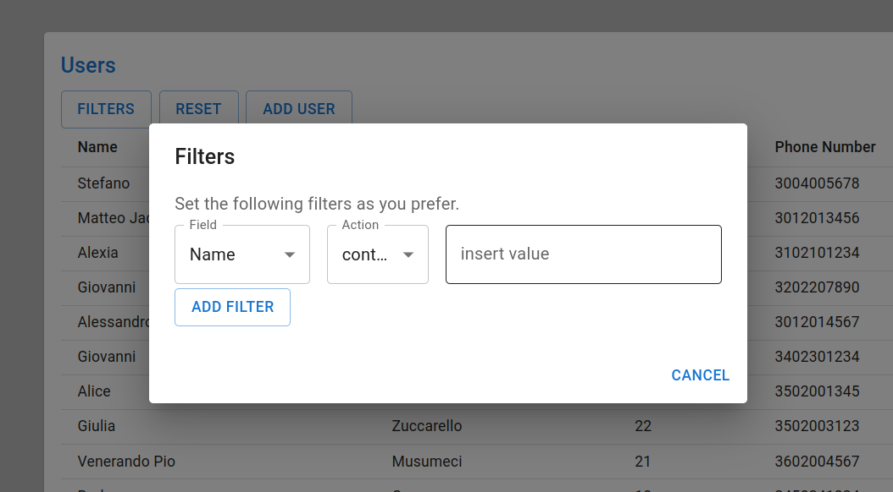
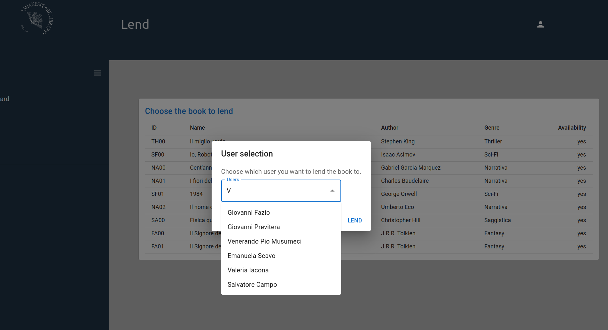

# shakespeare-library
#### Shakespeare library is a web application of a library developed in React and Typescrypt.


### Requirements of the application

The application had to simulate the functions within a library and had to be divided in 4 parts:

- **Dashboard**, made up of a list of books belonged by the library and a dialog for editing them;
- **Lend**, a page where the librarian can decide a user and a book to lend;
- **Take**, a simulation of a bar code scanner that shows a book info and make it possible to take it back;
- **Users**, a page containing a list of the library users, filters to search them and a button to add a new one;


### Design

The application has been designed in order to fulfill all the requirements as best as possible, considering efficiency, code readability and maintainability. I decided to develop it as a SPA, since it has no more than 4 pages and that it shouldn't carry huge amounts of data. Moreover, it is easier to maintain and to develop. Starting from this, I divided the application page into three components:

- the **HeaderBar**
- the **Menu**
- the **Context**



> Here is the application page divided into the HeaderBar, the Menu and the Context. In this example, the page is set on the Dashboard context, and as shown, it is divided into smaller components such as the BooksList, the BookChart and the TotalBooks.

The Context is the most important component, since that it is the one who carries all the different functionalities given by the application. Most of the components used are supplied by the MUI Library, a React library that has got plenty of well-made components ready to use.

Let's take a look at some components and their code:


### BooksList



 

```typescript
interface BooksListProps {
  readonly setBook: (row: Book) => void;
  readonly handleClickOpen: () => void;
  readonly isAvailable: boolean;
}

let books: Book[] = rows;

export const BooksList = (props: BooksListProps): React.ReactElement => {
  if(props.isAvailable) {
    books = rows.filter(r => r.available === true)
  }
  return (
    <Table size="small">
      <TableHead>
        <TableRow>
          <TableCell>ID</TableCell>
          <TableCell>Name</TableCell>
          <TableCell>Author</TableCell>
          <TableCell>Genre</TableCell>
          <TableCell align="right">Availability</TableCell>
        </TableRow>
      </TableHead>
      <TableBody>
        {books.map((row) => (
          <TableRow
            className="app-button"
            key={row.id}
            onClick={() => {
              props.setBook(row);
              props.handleClickOpen();
            }}
          >
            <TableCell>{row.id}</TableCell>
            <TableCell>{row.name}</TableCell>
            <TableCell>{row.author}</TableCell>
            <TableCell>{row.genre}</TableCell>
            <TableCell align="right">{`${
              row.available ? OPTION.YES : OPTION.NO
            }`}</TableCell>
          </TableRow>
        ))}
      </TableBody>
    </Table>
  );
};
```

Interface `BooksListProps` provides a safe check that grants that all parameters passed within the component are correct and reliable.

As shown the list is made up of MUI library components, such as TableHead, TableRow and TableCell, that put all together, show the list as above.


### Filter dialog and selectors




In this case it is better to divide the filter into multiple components in order to make it more maintainable.

```typescript
<Fragment>
      <Box sx={{ display: "flex" }}>
        <FieldsSelect
          handler={(e) => {
            handleFieldChange(e.target as HTMLInputElement);
          }}
        ></FieldsSelect>

        <ActionsSelect
          handler={(e) => {
            handleActionChange(e.target as HTMLInputElement);
          }}
          option1={"contains"}
          option2={"starts with"}
        ></ActionsSelect>

        <TextField
          autoFocus
          margin="dense"
          id={"value"}
          label={"insert value"}
          fullWidth
          variant="outlined"
          defaultValue={""}
          onChange={(e) => {
            handleValueChange(e.target as HTMLInputElement);
          }}
        ></TextField>
      </Box>
      <Button variant="outlined" onClick={createFilter}>
        Add filter
      </Button>
    </Fragment>
```


The filtering process is handled through the use of the custom interface Predicate, that enables the user to create multiple filters by manipulating string fields of the users' list.


### Lend book




> Attention: there are some side-effects related to mock data instead of fetching data from server-side

------


### Usage

npm is required for the package installation of dependencies and stuff. Once you have installed it, execute the following command

- npm -i
- npm run dev

To run the application on http://localhost:5173

Have fun!


### Author

Giovanni Campo
